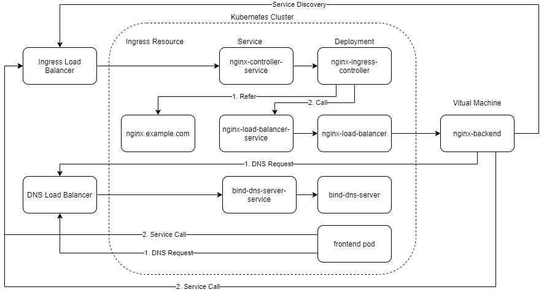

# kubernetes-nginx-service-discovery
This project is to support using kubernetes ingress resources to route traffic using NGINX to non-kubernetes endpoints
## Background
Kubernetes provides inbuilt service discovery, however, most of the organisations at this moment do not run 100% on Kubernetes and have mixed workloads of services running K8s and VMs. While discovering services within K8s is easy, services running within VMs do not get discovered natively by Kubernetes, especially the East-West communication. To foster internal service discovery between kubernetes resources and VM services and vice-versa, this project utilises the use of ingress resources to expose traffic to backend services running on VM. The VM can in-turn discover kubernetes services by utilising the same DNS server to make dynamic service discovery.


## Pre-Requisites
An ingress controller running within the kubernetes cluster
For more details with regards to setup see https://github.com/kubernetes/ingress-nginx

An example setup is present in the repo. This exposes the Nginx Ingress controller via a NodePort, and an NGINX Load Balancer sits in front of the NodePort to provide a single load-balanced endpoint to the setup. It also exposes the DNS server as a NodePort and NGINX Load Balancer described in the nginx.conf file caters to the DNS configuration as well.

If you are using a cloud provided kubernetes setup and can expose the ingress-controller and DNS-server as a load balancer service instead of a NodePort service as described. 

In any situation, you should arrive with a DNS Server Load Balancer IP and an Ingress Controller Load Balancer IP.

If you want to use the example setup do the following
```
git clone https://github.com/bharatmicrosystems/kubernetes-nginx-service-discovery.git
kubectl apply -f kubernetes-nginx-service-discovery/ingress/mandatory.yaml
kubectl apply -f kubernetes-nginx-service-discovery/ingress/service-nodeport.yaml
```

You would then need to spin up a new instance of a VM where you need to install nginx and copy the nginx.conf file to /etc/nginx/nginx.conf. The nginx.conf file assumes that you have a three-node cluster with node01, node02, and node03 as the hostnames for the worker nodes, you need to modify the nginx.conf file according to your setup.

Steps for installing NGINX is present on https://docs.nginx.com/nginx/admin-guide/installing-nginx/installing-nginx-open-source/

## Quick Start using Kubernetes Manifests
```
git clone https://github.com/bharatmicrosystems/kubernetes-nginx-service-discovery.git
sed -i "s/example.com/<YOUR DOMAIN>/g" kubernetes-nginx-service-discovery/bind-dns-server/dns-server.yaml
sed -i "s/dns_loadbalancer_ip_value/<YOUR DNS LOAD BALANCER IP>/g" kubernetes-nginx-service-discovery/bind-dns-server/dns-server.yaml
sed -i "s/ingress_loadbalancer_ip_value/<YOUR INGRESS LOAD BALANCER IP>/g" kubernetes-nginx-service-discovery/bind-dns-server/dns-server.yaml
kubectl apply -f kubernetes-nginx-service-discovery/bind-dns-server/dns-server.yaml
kubectl apply -f kubernetes-nginx-service-discovery/nginx-load-balancer/nginx.yaml
```
Make an entry on the coredns configuration for the bind dns server
```
kubectl edit -n kube-system cm/coredns
```
```
apiVersion: v1
kind: ConfigMap
metadata:
  name: coredns
  namespace: kube-system
data:
  Corefile: |
    .:53 {
        errors
        health
        kubernetes cluster.local in-addr.arpa ip6.arpa {
           pods insecure
           fallthrough in-addr.arpa ip6.arpa
        }
        prometheus :9153
        forward . 172.16.0.1
        cache 30
        loop
        reload
        loadbalance
    }
+    <YOUR DOMAIN HERE>:53 {
+        errors
+        cache 30
+        forward . <YOUR DNS LOAD BALANCER IP>
+    }
```

## Testing the setup
The tests consist of a sample backend application which we would be running on a container, however, you are free to spin up a VM and install NGINX in the VM to see this working.

```
#Setup the backend
kubectl apply -f kubernetes-nginx-service-discovery/nginx-load-balancer/test-backend/deployment.yaml
#Setup the ingress
sed -i "s/example.com/<YOUR DOMAIN>/g" kubernetes-nginx-service-discovery/nginx-load-balancer/ingress.yaml
kubectl apply -f kubernetes-nginx-service-discovery/nginx-load-balancer/ingress.yaml
curl -v http://nginx.<YOUR DOMAIN>
```
You can modify the ingress yaml to point to any backend service to your need by modifying the backend-host (can be hostname or IP of the backend service) and backend-port section in the ingress configuration. If there are multiple instances of backend service running, you can specify a comma-separated list of hosts and the nginx load balancer would take care of the load balancing as well.
```
---
apiVersion: extensions/v1beta1
kind: Ingress
metadata:
  name: nginx-backend-ingress
  annotations:
    nginx.ingress.kubernetes.io/add-base-url: "true"
    nginx.ingress.kubernetes.io/proxy-body-size: "0"
  labels:
    backend-host: "nginx-backend-host1,nginx-backend-host2"
    backend-port: "80"
spec:
  rules:
  - host: nginx.example.com
    http:
      paths:
        - path: /
          backend:
            serviceName: nginx-load-balancer
            servicePort: 80
```
